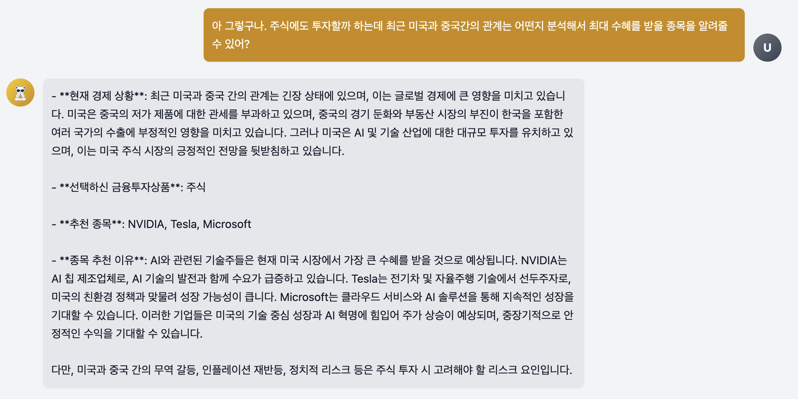

# 당신의 금융투자 친구, 머니또!


### 팀원: [김한송](https://github.com/Lycirrus), [윤정석](https://github.com/IcarusToSun), [조예슬](https://github.com/seul1230), [주현호](https://github.com/hyjoo1226)
### 프로젝트 기간: 2024.12.27 ~ 2025.01.03
<hr>
<br>

### 1. 프로젝트 소개
사용자와 경기를 기반으로 금융투자상품을 추천하는 RAG 기반 챗봇입니다!
> 투자자별 추천 금융투자종목과 최신 뉴스를 VectorDB에 저장하고 사용자 질문에 맞는 chunk를 찾아 답변을 보강하여, 사용자에게 더 정확한 투자종목을 제공합니다.

- 서비스 목표
    - 투자를 처음 시작하거나 정보가 부족한 사용자들에게 투자 정보 제공 및 투자 상품 추천
        > 투자 정보 부족으로 인한 금전 손실 방지 및 투자 전문가 접근성 문제 해결

- 타겟층
    > 2030 청년층, 투자 입문 및 초보자

- 제공 내용
    1. 뉴스 기반 투자 정보
        - 최신 경제 뉴스를 기반으로 사용자에게 최적의 금융투자상품 추천
    2. 투자 상품 및 종목 설명
        - 상품명 또는 용어가 생소한 초보자들을 위한 금융 기본 지식 제공
    3. 사용자 맟춤 피드백
        - 사용자 투자 성향을 분석하여 적합한 투자 전략 수립 및 정보 제공


### 2. 프로젝트 기본 내용
- document
    - 논문, 투자 정보 컬럼, 증권사 제공 정보를 기반으로 재정리한 자체 pdf 파일
    - 네이버 최신 경제 뉴스 (searchAPI)
    > HTML 형태로 변환하여 진행

- text_splitter
    - chunk_size : 1000
    - chunk_overlap : 100

- embedding
    - 사용 모델
        - upstage의 solar-mini (*embedding-query*)
        > 사용 이유 입력

- VectorDB
    - 사용 DB
        - Pinecone
        > Pinecone 사용 이유 입력
    - DB 내용
        - 사용자 투자 성향 : 설문조사 점수에 따른 사용자의 투자 성향
        - 최신 뉴스 : 네이버 searchAPI를 이용하여 최신 경제 뉴스 수집
        - 금융 이론 : 경기를 기반으로 경기 사이클에서 현재 위치 판단

- retriever & reranker
    - dense retriever
        - 유사도 계산 : mmr 알고리즘
        - 반환 문서 수 : 3개

    - cross-encoder
        - 사용 모델
            - BAAI/bge-reranker-base
            > 사용 이유 입력
        - 상위 문서 선택 수 : 3개

- 답변 생성 모델
    - GPT-4o-mini


### 3. 작동 방식

1. 사전 작업
    1. 투자자 성향, 금융 이론 PDF로 정리
    2. DocumentParse를 이용하여 PDF를 HTML 형태로 변환
    3. HTML 문서 Split하여 chunk들로 분할
    4. chunk들을 Embedding하여 PineconeVectorDB에 저장
2. 사용자 투자 성향 조사
    1. 챗봇 모달을 이용하여 사용자 설문 진행
    2. 프론트엔드에서 점수 계산 및 투자 유형을 결정
    3. 투자자 성향 백엔드로 전송
    4. 투자자 성향 VectorDB를 불러와 추천 종목 Retriever 진행
    5. 챗봇을 통해 추천 종목 출력
3. 투자 종목 관련 질문
    1. 사용자 선택 종목과 질문 수집
    2. 질문에서 키워드 추출
    3. SeachAPI를 이용하여 키워드 기반 네이버 뉴스 탐색
    4. 뉴스 내용을 Embedding하여 PineconeVectorDB에 저장
    5. PDF기반 VectorDB와 뉴스기반 VectorDB를 이용하여 최적의 답변 생성
    6. 3-1 ~ 3-5 과정 반복


### 4. 사용법
- 투자 성향을 조사하는 설문을 진행합니다.


- 투자 성향에 따른 추천 상품을 제공받습니다.


- 사용자는 추천받고 싶은 상품 버튼을 클릭하고, 해당 종목과 관련된 추가 질문을 입력하면 답변을 받을 수 있습니다.


- 사용자는 궁금증이 해소될 때까지 질문-답변 과정을 반복합니다.



1. 기대효과 
    1. 경제에 관심이 없는 사용자들의 투자 활동 유도
        - 투자에 관심이 없거나 지식이 부족했던 사람들에게 챗봇이라는 친근하고 쉬운 접근법 제공
        - 개인의 소비 패턴, 위험 성향, 목표 등을 분석해 적합한 금융 상품 추천
    2. 최신 정보 기반 투자 전략 선정 가능
        - 최신 경제 뉴스를 기반으로 단기적인 시장 변화 반영 및 경기 분석
        - 실시간 최적의 투자 전략 선정을 위한 자료 제공

2. 추후 개발
    1. 회원 관리 DB를 제작하여 더 세밀하게 투자 전략 제공
        > 현재는 새롭게 투자 성향 설문을 진행하면 기존 기록이 말소됨
        > <br>회원 DB를 만들어 지속적인 케어 서비스 제공
    2. 검색 시간 개선
        > 답변 생성까지 길게는 5초 이상 소요되는 경우도 있음
        > <br>챗봇의 목적인 빠르고 정확한 답변을 위해 답변 생성 속도 최적화
    3. 종목 추천을 위해 다양한 데이터 활용
        > 지금 답변은 최신 뉴스에 크게 기반하여 제공중임
        > <br>증시, 물가지수와 같은 경제 관련 지수 및 한국은행과 증권사들의 동향 보고서 등을 활용하여 다양성과 정확도를 향상


### 5. 배포 링크
- front
    - 프레임워크: Vercel
    - [moneytto-fe-eta.vercel.app](moneytto-fe-eta.vercel.app)

- back
    - 프레임워크: Fly.io
    - 로컬환경과 달리 배포환경에서 패키지 간 의존성 충돌 발생
        - ```
          ERROR: Cannot install -r requirements.txt (line 43), -r requirements.txt (line 93) and tokenizers==0.19.1 because these package versions have conflicting dependencies.
        
            The conflict is caused by:
            The user requested tokenizers==0.19.1
            langchain-upstage 0.4.0 depends on tokenizers<0.20.0 and >=0.19.1
            transformers 4.47.1 depends on tokenizers<0.22 and >=0.21 
          ```


### 6. 로컬 실행 방법

- front 
  - CORS 에러가 날 때는 추가로 CORS 확장 프로그램 이용
  ```
  PORT=5173 npm start
  ```
- back
  ```
  python app.py
  ```